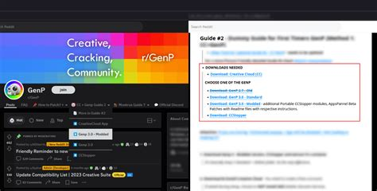
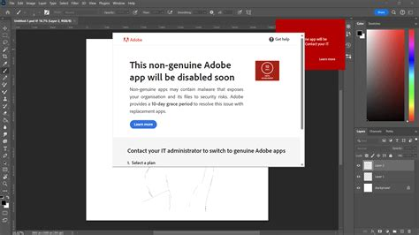

## GenP Adobe Hack - Full Version for PC

**➤➤➤ [Download GenP Adobe Free](https://goo.su/aUhmPO)**

You've probably come across the fact that Adobe products like Photoshop, Premiere or Illustrator are subscription-only. I recently came across a thing called **GenP**, which is, roughly speaking, a universal patcher for Adobe applications. It works as a tool that bypasses license checks.

It often comes bundled with Master Collection and allows you to run Creative Cloud programs without logging into an account or having a constant internet connection. GenP can disable Adobe Genuine Service, edit system components, and even block updates so the program doesn't crash after a restart.

---

### 🧩 What GenP Does

| Feature                         | Description                                               |
| ------------------------------- | --------------------------------------------------------- |
| Patches `amtlib.dll`            | Modifies or replaces Adobe activation files               |
| Disables Adobe Genuine Software | Prevents license verification and validation prompts      |
| Edits `hosts` file              | Blocks or redirects Adobe’s license servers               |
| Enables offline mode            | Lets apps run without Creative Cloud background service   |
| Supports full Master Collection | Works with all Adobe apps from Photoshop to After Effects |

---

genp adobe hack reddit

genp adobe hack

